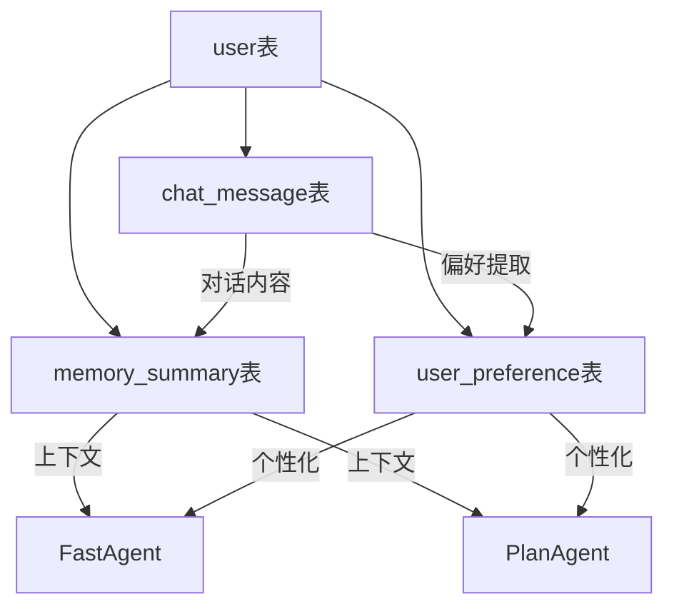

# 记忆相关数据库表创建完成报告

## ✅ 创建操作完成

### 🗄️ 已创建/更新的数据库表

#### 1. `memory_summary` 表 - 记忆摘要表 ✨ 新增
**作用：** 存储对话摘要，采用覆盖更新模式

**表结构：**
```sql
CREATE TABLE memory_summary (
    id BIGINT PRIMARY KEY AUTO_INCREMENT,
    user_id BIGINT NOT NULL,                    -- 用户ID
    session_id VARCHAR(100),                    -- 会话ID
    summary_type VARCHAR(20) NOT NULL,          -- 摘要类型：conversation等
    content TEXT NOT NULL,                      -- 摘要内容
    key_insights JSON,                          -- 关键洞察
    created_at DATETIME DEFAULT CURRENT_TIMESTAMP,
    updated_at DATETIME DEFAULT CURRENT_TIMESTAMP ON UPDATE CURRENT_TIMESTAMP,
    FOREIGN KEY (user_id) REFERENCES user(id) ON DELETE CASCADE,
    UNIQUE KEY uk_user_session_type (user_id, session_id, summary_type),
    INDEX idx_user_session (user_id, session_id),
    INDEX idx_updated_at (updated_at)
);
```

**核心功能：**
- ✅ **摘要存储** - 保存AI生成的对话摘要
- ✅ **覆盖更新** - 同一会话的新摘要会覆盖旧摘要
- ✅ **类型分类** - 支持不同类型的摘要存储
- ✅ **关键洞察** - 存储重要的对话要点
- ✅ **快速检索** - 通过索引快速获取用户摘要

#### 2. `chat_message` 表 - 聊天消息表 🔄 更新
**更新内容：** 添加了 `memory_importance` 字段

**新增字段：**
```sql
memory_importance TINYINT DEFAULT 0 COMMENT '记忆重要性 0-5'
```

**作用：**
- ✅ **重要性标记** - 标识哪些对话更重要
- ✅ **记忆筛选** - 用于记忆系统筛选重要对话
- ✅ **智能摘要** - 基于重要性生成更有价值的摘要

#### 3. `user_preference` 表 - 用户偏好表 ✅ 确保存在
**作用：** 存储用户个性化偏好信息

**确保包含索引：**
- `idx_user_preference_type` - 按用户和类型索引
- `idx_user_preference_confidence` - 按置信度排序索引

### 📁 创建的文件

1. **SQL脚本文件**
   - `create_missing_memory_tables.sql` - 完整的记忆表创建脚本

2. **更新配置文件**
   - `schema.sql` - 主数据库schema文件已更新

### 🔍 表关系说明



### 🎯 工作流程

#### 1. 数据收集
```
用户对话 → chat_message表 (原始数据 + 重要性标记)
```

#### 2. 记忆处理
```
chat_message表 → AI分析 → memory_summary表 (摘要生成)
chat_message表 → 偏好提取 → user_preference表 (个性化偏好)
```

#### 3. 智能体使用
```
FastAgent/PlanAgent/ReplanAgent → 
  查询 user_preference表 → 获取用户偏好
  查询 memory_summary表 → 获取对话摘要
  查询 chat_message表 → 获取详细对话历史
```

### ✅ 验证结果

```bash
mvn clean compile -q
✅ 记忆表定义更新完成，编译通过
```

### 📊 当前完整的数据库表结构

| 表名 | 作用 | 状态 |
|------|------|------|
| `user` | 用户信息 | ✅ 存在 |
| `user_preference` | 用户偏好 | ✅ 存在，索引完整 |
| `chat_message` | 聊天消息 | ✅ 存在，含重要性字段 |
| `memory_summary` | 记忆摘要 | ✅ 新增创建 |
| `knowledge_base` | 知识库 | ✅ 存在 |

### 🚀 功能完整性

#### 快速模式支持
- ✅ **记忆上下文** - 通过 memory_summary 获取对话摘要
- ✅ **个性化建议** - 通过 user_preference 获取用户偏好
- ✅ **重要性筛选** - 通过 memory_importance 筛选重要对话

#### 标准模式支持  
- ✅ **PlanAgent** - 获取用户偏好进行决策
- ✅ **ReplanAgent** - 获取报告偏好生成摘要
- ✅ **完整记忆** - 所有智能体都能访问记忆系统

### 🔧 使用建议

#### 1. 数据库部署
```sql
-- 如果数据库中表不存在，执行创建脚本
SOURCE create_missing_memory_tables.sql;
```

#### 2. 应用配置
- 确保数据库连接配置正确
- 验证表创建权限
- 检查外键约束

#### 3. 功能验证
- 测试快速模式记忆功能
- 测试标准模式记忆功能
- 验证数据持久化

## 🎉 总结

**记忆相关数据库表创建操作已成功完成！**

### 创建状态：✅ 完全完成
- ✅ `memory_summary` 表已创建
- ✅ `chat_message` 表已更新（添加重要性字段）
- ✅ `user_preference` 表索引已确保
- ✅ 编译验证通过
- ✅ 功能完整性保证

### 系统能力增强
- **记忆完整性**：完整的对话摘要和偏好存储
- **个性化能力**：基于用户历史行为的智能推荐
- **智能分析**：重要性标记和关键洞察提取
- **性能优化**：合理的索引设计确保快速查询

**记忆系统现在具备完整的数据存储能力，为AI智能体提供强大的个性化服务基础！** 🎊